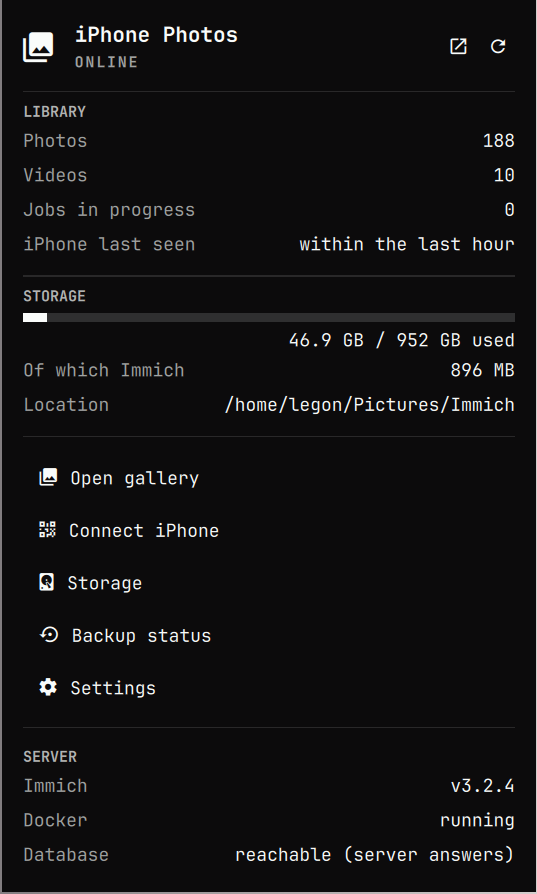

# Omarchy iPhone Photos

Back up the photos and videos on your iPhone to your own Omarchy PC over Wi-Fi.
[Immich](https://immich.app) does the work; this plugin installs it, watches it
and puts its controls in the Omarchy bar.



```text
iPhone ── Immich iOS app ──Wi-Fi──▶ Immich (Docker) ──▶ ~/Pictures/Immich
                                         ▲
                          Omarchy plugin: status, start/stop, QR code
```

## What it is and is not

Immich provides the iPhone app, the upload, duplicate detection, thumbnails,
the gallery and user accounts. The plugin transfers no photos and keeps no
database of its own. It shows what Immich's official API and the system
actually report; what cannot be determined is left out rather than estimated.

## Features

- Installs Immich from the official Docker Compose file of a pinned release,
  verified by checksum
- Detects an existing Immich installation and integrates it without changing it
- Checks the storage location (mounted, writable, filesystem, free space)
- Bar icon with server state and the number of jobs Immich is still processing
- Panel with photo and video counts, disk usage, when the iPhone was last
  seen, the server address with QR code, and storage and backup pages
- Start, stop, restart, logs and diagnostics
- Gallery in its own app window, with an "iPhone Photos" launcher entry
- `iphone-photos` command line tool with JSON output

## Requirements

- Omarchy 4
- Docker Engine with the Compose plugin (`docker`, `docker-compose`)
- 6 GB of memory (8 recommended), an x86-64-v2 CPU
- `python`, `qrencode`

All packages come from the official Arch repositories. Nothing from the AUR.

## Installation

```bash
omarchy plugin add https://github.com/Badr-Emil/omarchy-iphone-photos
omarchy plugin enable io.github.badr-emil.iphone-photos
```

The icon appears in the bar. Until Immich is set up, the panel shows a button
that opens the installer in a terminal. You can also start it yourself:

```bash
~/.config/omarchy/plugins/io.github.badr-emil.iphone-photos/scripts/install.sh
```

The installer explains every system change and asks before making it.
Details: [docs/installation.md](docs/installation.md)

## What the installer changes

| Change | Needs root | On uninstall |
|---|---|---|
| Packages `docker`, `docker-compose`, `qrencode` from the official repositories, if missing | yes | not removed |
| Enable `docker.service` at boot | yes | undone on request (default: no) |
| Start the Immich containers (`docker compose up -d`) | yes | removed on request (default: no) |
| `~/.local/share/omarchy-iphone-photos/immich/` with the compose file and `.env` | no | removed on request (default: no) |
| `~/.config/omarchy-iphone-photos/` with configuration and API key | no | removed on request (default: no) |
| Symlink `~/.local/bin/iphone-photos` | no | removed if it points to this plugin |
| Launcher entry "iPhone Photos" | no | removed if the installer created it |
| Widget entry in `~/.config/omarchy/shell.json` | no | removed |

The installer creates no service of its own and changes no firewall rule, no
sudoers file and no group membership. Immich's compose file comes from a
pinned release and is checked against a SHA-256 hash stored in the plugin.

While running, the plugin asks for your password only to start, stop or
restart Immich and to show its logs (`sudo` in a terminal, `pkexec` from the
panel). Monitoring needs no elevated rights.

## Set up Immich

Open `http://localhost:2283` and create an account; the first one becomes the
administrator. For photo and job counts in the panel, create an API key
(Account Settings → API Keys, permissions `asset.statistics`,
`server.statistics`, `queue.read`, `session.read`) and paste it under
Settings in the panel, or run `iphone-photos api-key set`.

## Set up the iPhone

1. Install Immich from the App Store
2. Enter the server address shown in the panel, or scan the QR code
3. Log in
4. Backup → choose albums → turn Backup on

iOS does not guarantee continuous background uploads; the backup is reliable
while the app is open. More: [docs/iphone-setup.md](docs/iphone-setup.md)

## Storage

The media folder is chosen during installation and stored as
`UPLOAD_LOCATION` in Immich's `.env`. The database lives separately on local
storage. An existing library is never moved automatically.
Checks and migration: [docs/storage.md](docs/storage.md)

## Backup

The library needs a backup of its own. Immich's nightly database dump
contains no photos and sits on the same disk. Version 0.1 shows the backup
state but does not set one up: [docs/backup.md](docs/backup.md)

## Security

- Immich is reachable in the local network only; no port forwarding, no UPnP,
  no firewall change
- The user is not added to the `docker` group; start and stop ask for the
  password
- The database password and the API key are stored in files with mode 600,
  never in QML, logs or Git
- No telemetry

## Command line

```bash
iphone-photos status [--json]
iphone-photos server status|start|stop|restart|logs
iphone-photos storage status
iphone-photos storage check <path> [--database]
iphone-photos backup status
iphone-photos address [--qr]
iphone-photos api-key set|clear|status
iphone-photos open [--browser]
iphone-photos diagnostics
```

## Tests

```bash
./scripts/test.sh
```

Backend tests that need neither Docker nor a running Immich, plus manifest
validation and `qmllint`.

## Troubleshooting

`iphone-photos diagnostics`, then [docs/troubleshooting.md](docs/troubleshooting.md)

## Removal

```bash
~/.config/omarchy/plugins/io.github.badr-emil.iphone-photos/scripts/uninstall.sh
omarchy plugin remove io.github.badr-emil.iphone-photos
```

The script removes only what the installer of this plugin created. An Immich
installation that existed before and was only integrated is left alone.
Photos, videos and the database are never deleted; the script prints their
paths at the end.

After the containers are removed, the Docker images and the model cache
remain. To remove them as well:

```bash
sudo docker image ls | grep -E 'immich|valkey'
sudo docker volume rm immich_model-cache
```

## More

- [docs/architecture.md](docs/architecture.md): structure and data sources
- [immich/README.md](immich/README.md): which Immich files are used

## License

MIT
